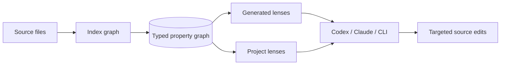
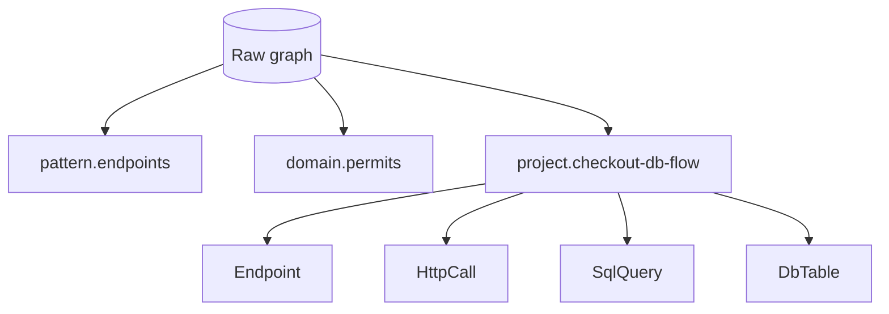

# Cartograph

Cartograph turns a codebase into a typed graph that coding agents can query before they search files. Its core idea is the **lens**: a saved Kuzu-style graph query that projects the same source graph through different abstractions, from raw endpoints to business flows, data access paths, ownership slices, or project-specific concepts.





Lenses are not hardcoded framework commands. A project can define its own `.cartograph/lenses/*.json` files with raw Kuzu Cypher, so an agent can ask questions like:

- "Which route reaches this controller and which SQL/table does it touch?"
- "Show the permit issuance transaction across services and Kafka topics."
- "Find the checkout flow, but only the part that crosses data boundaries."

## Quick Start

```bash
python -m cartograph index \
  --workspace fixtures/citypermits-workspace \
  --out cartograph-out/citypermits.graph.json \
  --report cartograph-out/GRAPH_REPORT.md

python -m cartograph tools

python -m cartograph flow \
  --graph cartograph-out/citypermits.graph.json \
  --anchor /api/permits/motor-vehicle

python -m cartograph lens list \
  --graph cartograph-out/citypermits.graph.json
```

## Lens Example

Configured lenses live under `.cartograph/lenses/*.json`. The JSON wrapper carries metadata; the query body is Kuzu-style Cypher.

```json
{
  "project.checkout-db-flow": {
    "kind": "query",
    "language": "kuzu-cypher",
    "returns": {
      "call": "HttpCall",
      "edge": "CROSSES_TIER",
      "route": "Endpoint",
      "lens": "Lens"
    },
    "query": [
      "MATCH (call:HttpCall)-[edge:CROSSES_TIER]->(route:Endpoint)",
      "OPTIONAL MATCH (lens:Lens)-[contains:CONTAINS]->(route:Endpoint)",
      "WHERE route.path CONTAINS $path",
      "RETURN call, edge, route, lens"
    ]
  }
}
```

Run it:

```bash
python -m cartograph lens \
  --graph cartograph-out/graph.json \
  --name project.checkout-db-flow \
  --workspace . \
  --params '{"path":"checkout"}'
```

The CLI validates referenced node labels and relationship types against the graph, checks returned values against the declared `returns` contract, and returns graph-shaped JSON plus row bindings.

## Agent Workflow

Install repo-local guidance for coding agents:

```bash
python -m cartograph install --platform codex --project .
python -m cartograph install --platform claude --project .
```

This writes agent-readable instructions that tell Codex/Claude to:

- read `cartograph-out/GRAPH_REPORT.md` before broad architecture answers
- run `cartograph tools` and graph queries before raw source search
- run `cartograph lens list` before creating a new project lens
- author project lenses as raw Kuzu Cypher, not Cartograph-specific DSL operators
- refresh the graph after service-code changes

Refresh a project graph:

```bash
python -m cartograph index \
  --workspace . \
  --out cartograph-out/graph.json \
  --report cartograph-out/GRAPH_REPORT.md
```

## Core Commands

```bash
python -m cartograph search --graph cartograph-out/graph.json --query "motor vehicle permit"
python -m cartograph endpoints-in-service --graph cartograph-out/graph.json --service permits-api
python -m cartograph cross-service-edges --graph cartograph-out/graph.json --from-service web
python -m cartograph kafka-topics --graph cartograph-out/graph.json --consumer-service inspections-api
python -m cartograph coverage-report --graph cartograph-out/graph.json
python -m cartograph explain --graph cartograph-out/graph.json --anchor /api/permits/motor-vehicle
python -m cartograph lens --graph cartograph-out/graph.json --name domain.permits
python -m cartograph lens list --graph cartograph-out/graph.json --workspace .
```

The same query layer is available through the optional JSON-lines bridge:

```bash
python -m cartograph serve --graph cartograph-out/graph.json
```

## Layers

Project-specific interpretation belongs in `.cartograph/` or explicit `--layer-dir` overlays:

- `.cartograph/packs/*.json` configures extraction vocabulary, including named message buses
- `.cartograph/lenses/*.json` defines raw Kuzu Cypher projections
- `.cartograph/views/*.json` defines simpler named list/group queries
- `.cartograph/plugins/*.py` contains reviewed local Python projections, opt-in only

```bash
python -m cartograph discover-packs --workspace . --out .cartograph/discovery.json

python -m cartograph index \
  --workspace . \
  --layer-dir .cartograph \
  --out cartograph-out/graph.json

python -m cartograph query \
  --graph cartograph-out/graph.json \
  --name my-view \
  --layer-dir .cartograph
```

Plugins execute local Python and require an explicit flag:

```bash
python -m cartograph run-plugin \
  --allow-plugin \
  --graph cartograph-out/graph.json \
  --plugin .cartograph/plugins/my_projection.py
```

See [docs/cartograph-layers.md](docs/cartograph-layers.md), [docs/cartograph-schemas.md](docs/cartograph-schemas.md), and [docs/m2-queryable.md](docs/m2-queryable.md).

## What It Indexes Today

The current extractor covers service-oriented Java/JS/TS code and configurable legacy Java patterns:

- Spring REST endpoints, HTTP clients, gateways, Eureka/service-registry patterns
- Kafka and configurable message bus producers/consumers
- React/JS frontend call sites and components
- Struts/Struts2 action XML as `Action` + `Endpoint`
- J2EE `web.xml` servlet mappings as `Servlet` + `Endpoint`
- SQL mapper XML, `.sql` files, and inline literal JDBC SQL as database query nodes

Project-specific conventions should be added through packs and lenses rather than hardcoded in Cartograph core.

## Imports

Import a CodeGraphContext JSON export:

```bash
python -m cartograph import-cgc \
  --input fixtures/cgc/sample-cgc.json \
  --out cartograph-out/cgc.graph.json
```

Merge runtime trace evidence into an existing graph:

```bash
python -m cartograph import-trace \
  --graph cartograph-out/graph.json \
  --otlp path/to/trace.json \
  --out cartograph-out/graph.with-trace.json
```

## Real Repo Harness

The harness clones pinned public repositories into `.cartograph-real-repos/`, materializes selected services into one workspace, indexes them, and verifies the graph.

```bash
bash scripts/verify_real_repos.sh
```

Current corpus:

- `piomin/sample-spring-kafka-microservices`
- `spring-petclinic/spring-petclinic-microservices`
- `ewolff/microservice-kafka`
- `apache/struts-examples`

## Verification

```bash
bash scripts/quality.sh
```

The quality gate runs Ruff formatting checks, Ruff linting, `compileall`, mypy, and pytest. For local development:

```bash
python -m pip install -e ".[dev]"
make format
make quality
```

Additional fixture checks:

```bash
pytest -q
python -m cartograph index --workspace fixtures/citypermits-workspace --out cartograph-out/citypermits.graph.json
python -m cartograph verify --graph cartograph-out/citypermits.graph.json --suite fixtures/expectations/citypermits-m1.yaml
bash scripts/verify_real_repos.sh
```

Generated outputs are ignored under `cartograph-out/` and `.cartograph-real-repos/`.
